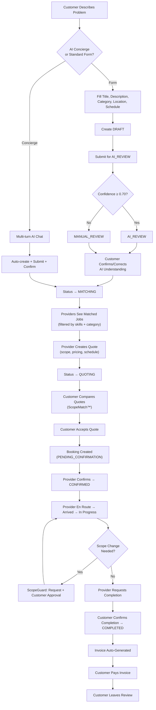
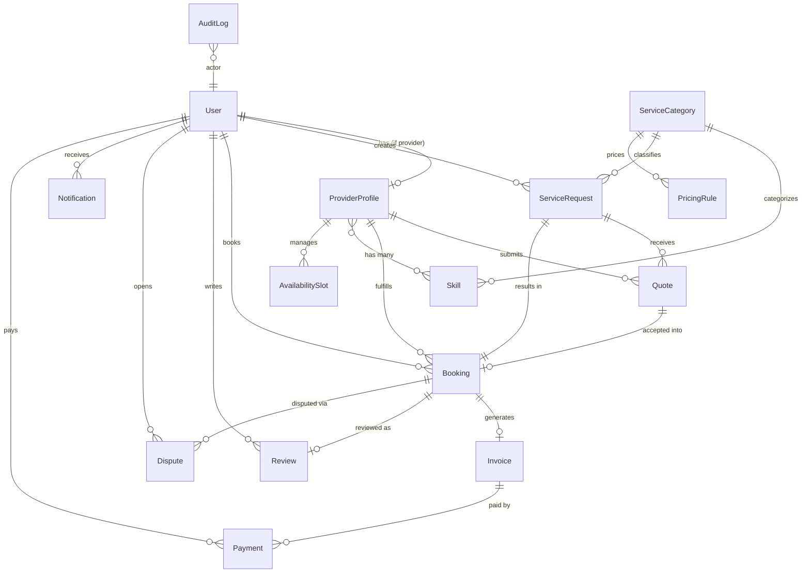

<p align="center">
  
  
  
  
  
</p>

# CareConnect — AI-Powered Home Services Platform

**CareConnect** is a full-stack MERN application that connects customers with verified home-service professionals. It uses **Google Gemini AI** to analyze service requests (including uploaded photos), automatically match providers by skill and location, and deliver real-time status updates through **Server-Sent Events (SSE)** — all governed by strict **Role-Based Access Control** across five distinct user roles.

---

## Table of Contents

| Section | Description |
|---|---|
| [Key Features](#-key-features) | Platform capabilities and differentiators |
| [User Roles](#-five-tier-user-ecosystem) | RBAC roles and what each can do |
| [AI Capabilities](#-ai-capabilities) | Gemini integration, concierge, and analysis |
| [Core Workflow](#-core-workflow) | End-to-end service lifecycle |
| [Architecture](#-architecture) | System design, SSE, and data flow |
| [Tech Stack](#-tech-stack) | Frontend, backend, and infrastructure |
| [Database Schema](#-database-schema) | 15 MongoDB collections |
| [API Reference](#-api-reference) | All REST endpoints |
| [Project Structure](#-project-structure) | Repository layout |
| [Local Development](#-local-development-setup) | Prerequisites, install, run |
| [Environment Variables](#-environment-variables) | Full configuration reference |
| [Testing](#-testing) | Test suite and how to run |
| [Seed Data](#-seed-data) | Populating the database |
| [Deployment](#-deployment) | Vercel and production notes |
| [License](#-license) | ISC License |

---

## ✨ Key Features

### 🤖 Smart Request AI (AI Concierge)
A conversational AI assistant embedded in the customer dashboard. Customers describe their problem in plain language (e.g. *"My AC is leaking water"*), and the Gemini-powered concierge asks clarifying questions, diagnoses the issue, provides a price estimate, and auto-creates a fully formed service request — bypassing the traditional form entirely.

### 🔬 Multimodal AI Analysis
When a service request is submitted, Gemini analyzes the title, description, **and any attached photos** (sent as base64 inline data) to produce a structured diagnosis: identified problem type, urgency level, suggested repair tasks, required skills, confidence score, and any missing information the customer should provide.

### 🎯 Intelligent Provider Matching
Providers are ranked by a composite score that considers: **skill overlap** with the AI-identified required skills, **service area** proximity, **availability slot** coverage, **existing booking conflicts**, **experience years**, **average rating**, and **completed job count**.

### 🛡️ ScopeGuard
During active bookings (`CONFIRMED`, `ARRIVED`, `IN_PROGRESS`), providers can request scope changes — additional work items with cost adjustments. Each request requires **explicit customer approval** before the pricing snapshot is updated, eliminating offline cash disputes.

### ⏱️ ServiceTrace
An immutable, chronological timeline for every booking. It aggregates events from the service request, AI analysis, quote acceptance, every booking status transition, evidence uploads, scope changes, invoice issuance, reviews, and disputes into a single auditable log.

### 📸 Proof Pack
Providers upload photographic evidence at each stage of the job (before service, during scope changes, after completion). Evidence is stored with metadata (type, description, uploader, timestamp) and accessible through the Proof Pack API.

### 🔄 ScopeMatch™
A side-by-side quote comparison view where customers can evaluate multiple provider quotes simultaneously — comparing total price, pricing breakdown (labor, materials, tax), scope of work, included tasks, exclusions, estimated duration, and provider rating — with visual indicators for "Best Price" and "Highest Rated".

### 📡 Real-Time Updates (SSE)
A custom Server-Sent Events implementation (no Socket.IO dependency) that broadcasts cache-invalidation tags whenever any mutation occurs. The frontend RTK Query cache automatically refetches only the affected queries, so dashboards, booking statuses, and notifications update instantly across all open tabs.

### 💳 Invoice & Payment Flow
Invoices are auto-generated when a booking reaches `COMPLETED` status. Customers can pay invoices through a modal supporting Card, UPI, NetBanking, and Wallet methods. Payment processing includes duplicate payment prevention and automatic invoice status updates.

### ⭐ Review & Rating System
Customers can review completed bookings with a 1–5 star rating and comment. Provider rating summaries (average rating, review count) are recalculated in real-time and used in provider matching scores and the "Featured Providers" section on the homepage.

---

## 👥 Five-Tier User Ecosystem

CareConnect enforces strict RBAC. Each role has a dedicated dashboard and can only access routes and data permitted by its role.

| Role | Registration | Key Capabilities |
|---|---|---|
| **Customer** | Public (self-register) | Create service requests (AI or manual), review AI understanding, confirm/correct diagnosis, compare quotes (ScopeMatch™), accept quotes, track bookings via ServiceTrace, approve/reject scope changes, confirm completion, pay invoices, leave reviews, open disputes |
| **Service Provider** | Public (self-register) | Set up profile (skills, service areas, experience, pricing), manage availability slots, browse matched job opportunities, create and submit quotes with scope and pricing breakdown, manage bookings through full lifecycle (confirm → en route → arrived → start → request completion), upload Proof Pack evidence, request scope changes |
| **Operations Manager** | Admin-created | Monitor all service requests, manage provider verification queue (PENDING → UNDER_REVIEW → VERIFIED / REJECTED / SUSPENDED), view operational dashboards with live booking and dispute metrics |
| **Support Agent** | Admin-created | Access dispute queue, review dispute details with ServiceTrace audit trail, update dispute status through resolution workflow (OPEN → UNDER_REVIEW → AWAITING_EVIDENCE → RESOLUTION_PROPOSED → RESOLVED / REJECTED / ESCALATED) |
| **Admin** | Admin-created | Full platform access: user management, provider management, category/skill/pricing-rule CRUD, analytics dashboard (quote acceptance rate, booking conversion, revenue, category demand, satisfaction metrics), audit log viewer, realtime connection stats |

---

## 🧠 AI Capabilities

### Architecture

```
Customer Input (text + images)
        │
        ▼
┌─────────────────────────┐
│   Google Gemini API     │
│   (gemini-2.5-flash)    │
│                         │
│  • Multimodal analysis  │
│  • JSON structured out  │
│  • Conversation mode    │
└────────────┬────────────┘
             │
     ┌───────┴───────┐
     ▼               ▼
  AI Analysis    AI Concierge
  (on submit)    (chat flow)
```

### Three AI Functions

| Function | Trigger | What It Does |
|---|---|---|
| `analyzeServiceRequest` | Customer submits a service request | Sends title, description, and base64 images to Gemini. Returns: matched category, required skills, problem type, urgency, diagnostic notes, suggested tasks, missing information, confidence score (0–1) |
| `reanalyzeAfterCorrection` | Customer corrects the AI understanding | Re-prompts Gemini with the original analysis plus customer corrections. Recalculates confidence and missing info |
| `aiConcierge` | Customer uses Smart Request AI chat | Multi-turn conversation flow. Gemini asks clarifying questions (max 2), then returns: title, category, problem type, price estimate range, technical brief, and urgency |

### Deterministic Fallback

When the Gemini API key is not configured or the API call fails, a **keyword-based fallback engine** activates. It maps 30+ Indian household keywords (AC, refrigerator, geyser, mixer, tap, MCB, etc.) to specific problem types and urgency levels, ensuring the platform never blocks on an AI outage.

### Confidence Scoring

The AI confidence score (0–0.98) is calculated from five factors:

| Factor | Weight | Criteria |
|---|---|---|
| Description quality | 0–0.30 | Length: >100 chars = 0.30, >40 = 0.20, >10 = 0.10 |
| Category match | 0–0.30 | Gemini-identified category exists in the database |
| Skills identification | 0–0.20 | At least one matching skill found |
| Location specificity | 0–0.10 | Address line 1 is provided |
| Visual context | 0–0.15 | At least one photo attached |

Requests with confidence < 0.70 are flagged for `MANUAL_REVIEW`.

---

## 🔄 Core Workflow



### Booking Status Lifecycle

```
PENDING_CONFIRMATION → CONFIRMED → PROVIDER_EN_ROUTE → ARRIVED → IN_PROGRESS → AWAITING_CUSTOMER_CONFIRMATION → COMPLETED
                                                                                                                    ↓
                                                                                              (any active state) → CANCELLED
```

### Quote Status Lifecycle

```
DRAFT → SUBMITTED → VIEWED → CHANGES_REQUESTED → REVISED → ACCEPTED
                                                           → REJECTED
                                                           → EXPIRED
                                                           → WITHDRAWN
```

---

## 🏗️ Architecture

### System Overview

```
┌─────────────────────────────────────────────────────────────┐
│                     FRONTEND (React 18 + Vite)              │
│                                                             │
│  Redux Toolkit Store ◄──── RTK Query Cache ◄──── SSE Tags  │
│         │                       │                    ▲      │
│         ▼                       ▼                    │      │
│  Role-Based Router        REST API Calls        EventSource │
│  (5 dashboard types)     (Bearer JWT auth)     (fetch-based)│
└──────────────┬──────────────────┬────────────────────┬──────┘
               │                  │                    │
               ▼                  ▼                    ▼
┌─────────────────────────────────────────────────────────────┐
│                   BACKEND (Express.js + Node.js ≥20)        │
│                                                             │
│  ┌──────────┐  ┌──────────────┐  ┌───────────────────────┐  │
│  │ Auth     │  │ Business     │  │ Realtime Hub          │  │
│  │ Middleware│  │ Controller   │  │ (SSE broadcast,       │  │
│  │ (JWT)   │  │ (1388 lines) │  │  user/role targeting,  │  │
│  └──────────┘  └──────────────┘  │  heartbeat watchdog)   │  │
│                      │           └───────────────────────┘  │
│         ┌────────────┼────────────────┐                     │
│         ▼            ▼                ▼                     │
│  ┌────────────┐ ┌──────────┐  ┌─────────────┐              │
│  │ AI Service │ │ Matching │  │ Availability │              │
│  │ (Gemini)   │ │ Service  │  │ Service      │              │
│  └────────────┘ └──────────┘  └─────────────┘              │
│         │            │                │                     │
│         ▼            ▼                ▼                     │
│  ┌─────────────────────────────────────────────┐            │
│  │           MongoDB (Mongoose ODM)            │            │
│  │           15 Collections, Indexed           │            │
│  └─────────────────────────────────────────────┘            │
└─────────────────────────────────────────────────────────────┘
```

### Real-Time Data Flow (SSE)

The SSE system is **dependency-free** (no Socket.IO). It works in three layers:

1. **Realtime Hub** (`realtime.hub.js`): Manages an in-memory Map of connected SSE clients. Supports `broadcast`, `emitToUser`, and `emitToRoles`. Sends heartbeat pings every 25 seconds to prevent proxy timeouts.

2. **Change-Feed Middleware** (`realtime.middleware.js`): Intercepts every successful `POST/PUT/PATCH/DELETE` response and broadcasts `data:changed` events with entity tags (e.g., `["Booking", "ServiceRequest", "Invoice"]`). Controllers require zero modifications — the middleware derives tags from the URL path.

3. **Frontend Client** (`realtimeClient.js`): A `fetch` + `ReadableStream` SSE client (not native `EventSource`) so the JWT can be sent in the `Authorization` header. Features exponential backoff with jitter, a 60-second watchdog timer, and automatic reconnect on tab visibility / network changes.

### Notification System

Notifications are persisted to MongoDB **and** pushed to the recipient's open SSE streams in the same write operation via a Mongoose `post('save')` hook. The frontend invalidates the `Notification` RTK Query tag on each push, so the notification bell updates instantly.

---

## 🛠️ Tech Stack

### Frontend

| Technology | Version | Purpose |
|---|---|---|
| React | 18.3.1 | UI library |
| Vite | 5.4.6 | Build tool and dev server |
| Redux Toolkit | 2.2.7 | State management |
| RTK Query | (bundled) | Data fetching, caching, cache invalidation |
| React Router DOM | 6.26.2 | Client-side routing with role-based guards |
| Lucide React | 0.441.0 | Icon library |
| CSS Modules + Design Tokens | — | `tokens.css` (color, spacing, typography) + `global.css` |

### Backend

| Technology | Version | Purpose |
|---|---|---|
| Node.js | ≥ 20.0.0 | Runtime |
| Express.js | 4.21.2 | HTTP framework |
| Mongoose | 8.9.5 | MongoDB ODM |
| @google/genai | 2.23.0 | Google Gemini AI (multimodal) |
| jsonwebtoken | 9.0.3 | JWT authentication |
| bcryptjs | 3.0.3 | Password hashing (12 salt rounds) |
| Helmet | 8.0.0 | Security headers |
| CORS | 2.8.5 | Cross-origin resource sharing |
| Multer | 2.4.0 | File upload (memory storage, 10 MB limit) |
| Cloudinary | 2.11.0 | Image hosting (optional — falls back to base64) |
| Nodemon | 3.1.9 | Dev auto-restart |
| Supertest | 7.0.0 | HTTP integration testing |

### Infrastructure

| Component | Details |
|---|---|
| Database | MongoDB (local or Atlas) |
| Realtime | Custom SSE (no external dependencies) |
| AI Model | Google Gemini (`gemini-2.5-flash`) |
| Image Storage | Cloudinary (optional) or base64 data URIs |
| Deployment | Vercel (frontend SPA), any Node.js host (backend) |

---

## 🗄️ Database Schema

CareConnect uses **15 MongoDB collections**, all defined with Mongoose schemas and strategic compound indexes.



### Collection Summary

| Collection | Key Fields | Indexes |
|---|---|---|
| **User** | name, email, passwordHash, phone, profileImage, role (5 values), status | email (unique), role, status |
| **ProviderProfile** | user (ref), displayName, bio, experienceYears, serviceAreas[], skills[] (ref), verificationStatus, pricing, ratingSummary | user (unique), skills, verificationStatus |
| **ServiceCategory** | name, slug (unique), description, isActive | — |
| **Skill** | name, slug (unique), description, category (ref), isActive | category + isActive |
| **PricingRule** | category (ref), service, serviceArea, currency, basePrice, laborCharge, materialCharge | category + service + serviceArea + isActive |
| **AvailabilitySlot** | provider (ref), startAt, endAt, timezone, status | provider + startAt + endAt, provider + status + startAt |
| **ServiceRequest** | customer (ref), title, description, category (ref), attachments[], location, preferredSchedule, urgency, status (10 values), aiUnderstanding, confirmedUnderstanding, customerCorrections[] | customer + status + createdAt, category + status |
| **Quote** | serviceRequest (ref), provider (ref), scope (summary, tasks, exclusions), pricingBreakdown, totalAmount, estimatedDuration, validUntil, status (9 values) | serviceRequest + status, provider + status |
| **Booking** | serviceRequest (unique ref), acceptedQuote (unique ref), customer, provider, scheduledStartAt/EndAt, status (8 values), customerSnapshot, providerSnapshot, scopeSnapshot, pricingSnapshot, statusEvents[], evidence[], scopeChanges[] | customer + status, provider + status, scheduledStartAt + EndAt |
| **Invoice** | booking (unique ref), customer, provider, invoiceNumber (unique), lineItems[], subtotal, tax, discount, total, currency, status, paymentStatus | customer + status |
| **Payment** | invoice (ref), customer, provider, amount, currency, method, status, gatewayTransactionId, paidAt | customer + createdAt |
| **Review** | booking (unique ref), customer, provider, rating (1–5), comment, status | provider + status |
| **Dispute** | booking (ref), serviceRequest (ref), openedBy, reason (enum), description, status (7 values), resolution, assistantSummary | booking + status, openedBy + status |
| **Notification** | recipient (ref), type (20 values), title, message, relatedResource, isRead | recipient + isRead + createdAt |
| **AuditLog** | actor (ref), action, resourceType, resourceId, metadata | — |

---

## 📡 API Reference

**Base URL:** `/api/v1`

All endpoints return JSON with the shape `{ success: boolean, message: string, data?: object }`.
Protected endpoints require `Authorization: Bearer <token>` header.

### Authentication

| Method | Endpoint | Auth | Description |
|---|---|---|---|
| `POST` | `/auth/register` | Public | Register (CUSTOMER or SERVICE_PROVIDER) |
| `POST` | `/auth/login` | Public | Login, returns JWT |
| `GET` | `/auth/me` | ✅ | Get authenticated user |
| `PATCH` | `/auth/me` | ✅ | Update name, phone, profileImage |
| `POST` | `/auth/me/profile-image` | ✅ | Upload profile image (multipart) |
| `POST` | `/auth/logout` | ✅ | Logout (client-side token removal) |

### Service Requests

| Method | Endpoint | Auth | Description |
|---|---|---|---|
| `POST` | `/service-requests` | Customer | Create a draft service request |
| `GET` | `/service-requests` | ✅ | List requests (scoped by role + provider skills) |
| `GET` | `/service-requests/:id` | ✅ | Get single request |
| `PATCH` | `/service-requests/:id` | Customer | Update draft request |
| `POST` | `/service-requests/:id/submit` | Customer | Submit for AI analysis |
| `POST` | `/service-requests/:id/cancel` | ✅ | Cancel request |
| `PATCH` | `/service-requests/:id/ai-understanding` | Customer | Correct AI understanding |
| `GET` | `/service-requests/:id/matches` | ✅ | Get ranked provider matches |
| `POST` | `/service-requests/:id/quotes` | Provider | Create a quote for this request |
| `GET` | `/service-requests/:id/quotes` | ✅ | List quotes for this request |

### Quotes

| Method | Endpoint | Auth | Description |
|---|---|---|---|
| `GET` | `/quotes` | ✅ | List quotes (provider sees own) |
| `POST` | `/quotes/requests/:id` | Provider | Create quote for a request |
| `GET` | `/quotes/:id` | ✅ | Get single quote |
| `PATCH` | `/quotes/:id` | ✅ | Update scope/pricing |
| `POST` | `/quotes/:id/submit` | Provider | Submit quote (with conflict validation) |
| `POST` | `/quotes/:id/accept` | Customer | Accept quote → create booking |
| `POST` | `/quotes/:id/reject` | ✅ | Reject quote |
| `POST` | `/quotes/:id/request-changes` | Customer | Request quote modifications |

### Bookings

| Method | Endpoint | Auth | Description |
|---|---|---|---|
| `GET` | `/bookings` | ✅ | List bookings (scoped by role) |
| `GET` | `/bookings/:id` | ✅ | Get booking with invoice |
| `POST` | `/bookings/:id/confirm` | Provider | Confirm booking |
| `POST` | `/bookings/:id/en-route` | Provider | Mark en route |
| `POST` | `/bookings/:id/arrived` | Provider | Mark arrived |
| `POST` | `/bookings/:id/start` | Provider | Start service |
| `POST` | `/bookings/:id/request-completion` | Provider | Request completion confirmation |
| `POST` | `/bookings/:id/confirm-completion` | Customer | Confirm job completed → auto-invoice |
| `POST` | `/bookings/:id/cancel` | ✅ | Cancel booking |
| `POST` | `/bookings/:id/evidence` | ✅ | Upload Proof Pack evidence (multipart) |
| `POST` | `/bookings/:id/scope-changes` | Provider | Request ScopeGuard change |
| `POST` | `/bookings/:id/scope-changes/:changeId/approve` | Customer | Approve scope change |
| `POST` | `/bookings/:id/scope-changes/:changeId/reject` | Customer | Reject scope change |
| `GET` | `/bookings/:id/service-trace` | ✅ | Get full ServiceTrace timeline |
| `GET` | `/bookings/:id/proof-pack` | ✅ | Get Proof Pack evidence |
| `POST` | `/bookings/:id/invoice` | ✅ | Generate invoice |

### Invoices & Payments

| Method | Endpoint | Auth | Description |
|---|---|---|---|
| `GET` | `/invoices` | ✅ | List invoices |
| `POST` | `/invoices/booking/:id` | ✅ | Create invoice for booking |
| `GET` | `/invoices/:id` | ✅ | Get invoice |
| `GET` | `/invoices/:id/download` | ✅ | Download invoice (text) |
| `PATCH` | `/invoices/:id` | Admin/Ops | Update invoice status |
| `GET` | `/payments` | ✅ | List payments |
| `GET` | `/payments/:id` | ✅ | Get single payment |
| `POST` | `/payments` | Customer | Process payment |

### Reviews & Disputes

| Method | Endpoint | Auth | Description |
|---|---|---|---|
| `GET` | `/reviews` | Public | List reviews |
| `POST` | `/reviews` | Customer | Create review for completed booking |
| `POST` | `/disputes` | ✅ | Open dispute |
| `GET` | `/disputes` | ✅ | List disputes (scoped) |
| `GET` | `/disputes/:id` | ✅ | Get dispute detail |
| `PATCH` | `/disputes/:id` | Admin/Support | Update dispute status/resolution |

### Providers & Categories

| Method | Endpoint | Auth | Description |
|---|---|---|---|
| `GET` | `/providers` | Public | List providers |
| `GET` | `/providers/featured` | Public | Top-rated verified providers |
| `GET` | `/providers/:id` | Public | Get provider profile |
| `GET` | `/providers/me` | Provider | Get own profile |
| `PATCH` | `/providers/me` | Provider | Update own profile |
| `POST` | `/providers/:id/verification` | Admin/Ops | Update verification status |
| `GET` | `/categories` | Public | List active categories |
| `POST` | `/categories` | Admin | Create category |
| Full CRUD | `/skills`, `/pricing-rules`, `/availability` | ✅ | Manage skills, pricing, availability |

### Notifications, Analytics, AI & Realtime

| Method | Endpoint | Auth | Description |
|---|---|---|---|
| `GET` | `/notifications` | ✅ | List notifications (last 50) |
| `PATCH` | `/notifications/read-all` | ✅ | Mark all read |
| `PATCH` | `/notifications/:id/read` | ✅ | Mark single read |
| `POST` | `/notifications/quote-request` | ✅ | Send quote request to provider |
| `GET` | `/analytics/stats` | Public | Platform-wide public stats |
| `GET` | `/analytics/summary` | Admin/Ops | Full analytics dashboard data |
| `GET` | `/audit-logs` | Admin | List audit trail |
| `POST` | `/ai/concierge` | ✅ | AI concierge conversation |
| `GET` | `/realtime/stream` | ✅ | SSE stream (long-lived) |
| `GET` | `/realtime/stats` | Admin | Live SSE connection stats |
| `GET` | `/health` | Public | API health + DB status |
| `GET` | `/stats` | Public | Public platform summary |
| `GET` | `/testimonials` | Public | Published reviews for homepage |

---

## 📁 Project Structure

```
CareConnect/
├── package.json                    # Root monorepo scripts
├── vercel.json                     # Vercel deployment config (frontend)
├── .gitignore
│
├── backend/
│   ├── package.json                # Backend dependencies & scripts
│   ├── .env.example                # Environment variable template
│   ├── seed.js                     # Quick seed (categories + customer)
│   ├── seedCategories.js           # Full category + skill + pricing seed
│   ├── seedUsers.js                # Seed customer, provider, admin users
│   ├── seedProviders.js            # Seed provider profiles
│   ├── tests/
│   │   ├── app.test.js             # Health, stats, 404, CORS tests
│   │   ├── auth.test.js            # Registration, login, JWT, RBAC tests
│   │   ├── business.test.js        # Full lifecycle integration test
│   │   ├── models.test.js          # Schema validation & constraint tests
│   │   └── payment.test.js         # Payment flow tests
│   ├── scripts/
│   │   ├── create-test-workflow.js
│   │   ├── seed-atlas-roles.js
│   │   └── ...
│   └── src/
│       ├── server.js               # Entry point, DB connect, auto-seed
│       ├── app.js                  # Express app factory
│       ├── config/
│       │   ├── env.js              # Centralized env config with validation
│       │   ├── database.js         # Mongoose connection management
│       │   └── cloudinary.js       # Cloudinary SDK config
│       ├── controllers/
│       │   ├── auth.controller.js  # Register, login, profile, image upload
│       │   ├── business.controller.js  # All business logic (1388 lines)
│       │   └── ai.controller.js    # AI concierge endpoint
│       ├── services/
│       │   ├── ai.service.js       # Gemini integration + fallback engine
│       │   ├── matching.service.js # Provider ranking algorithm
│       │   ├── availability.service.js # Overlap & conflict validation
│       │   ├── trace.service.js    # ServiceTrace builder
│       │   ├── invoice.service.js  # Invoice generation
│       │   ├── auth.service.js     # JWT, password hashing, token verify
│       │   ├── notification.service.js # Notification persistence
│       │   └── audit.service.js    # Audit log recording
│       ├── models/                 # 15 Mongoose schemas
│       ├── routes/v1/              # 18 route files
│       ├── middleware/
│       │   ├── auth.middleware.js   # Bearer token extraction + user load
│       │   ├── role.middleware.js   # Role authorization
│       │   ├── error.middleware.js  # Centralized error normalization
│       │   ├── upload.middleware.js # Multer config (memory, 10 MB)
│       │   └── notFound.middleware.js
│       ├── realtime/
│       │   ├── realtime.hub.js     # SSE client management + broadcast
│       │   └── realtime.middleware.js  # Auto change-feed from HTTP mutations
│       ├── validators/
│       │   └── auth.validator.js   # Registration & login input validation
│       ├── utils/                  # AppError, access helpers, logger, etc.
│       └── constants/
│           └── httpStatus.js
│
└── frontend/
    ├── package.json                # Frontend dependencies & scripts
    ├── .env.example                # Frontend env template
    ├── vite.config.js              # Vite config with API proxy & path alias
    ├── index.html                  # SPA entry
    ├── vercel.json                 # Frontend-specific Vercel config
    └── src/
        ├── main.jsx                # React DOM render
        ├── App.jsx                 # Root component
        ├── api/
        │   └── apiSlice.js         # RTK Query base API (16 tag types)
        ├── app/
        │   ├── store/store.js      # Redux store configuration
        │   ├── router/AppRouter.jsx # All route definitions (40+ routes)
        │   └── providers/AppProviders.jsx  # Redux, Session, Realtime, Router
        ├── realtime/
        │   ├── realtimeClient.js   # Fetch-based SSE client with reconnection
        │   └── realtimeSlice.js    # Realtime connection state
        ├── features/               # 18 feature slices (RTK Query endpoints)
        │   ├── ai/                 # AI concierge API
        │   ├── auth/               # Login, register, session
        │   ├── bookings/           # Booking CRUD + transitions
        │   ├── serviceRequests/    # Request lifecycle
        │   ├── quotes/             # Quote management
        │   ├── providers/          # Provider profiles
        │   ├── analytics/          # Dashboard analytics
        │   └── ...                 # categories, skills, invoices, payments,
        │                           # reviews, disputes, notifications, etc.
        ├── components/
        │   ├── SmartRequestFlow/   # AI Concierge chat component
        │   ├── booking/            # ServiceTrace, ScopeChange components
        │   ├── ui/                 # Reusable UI primitives
        │   ├── Hero/               # Landing page hero
        │   ├── Stats/              # Animated statistics
        │   ├── Testimonials/       # Real review testimonials
        │   └── ...
        ├── pages/
        │   ├── HomePage.jsx        # Public landing page
        │   ├── customer/           # 14 customer pages
        │   ├── provider/           # 8 provider pages
        │   ├── admin/              # 8 admin pages
        │   ├── operations/         # 4 operations pages
        │   ├── support/            # 4 support pages
        │   ├── shared/             # Invoices, Notifications, Payments
        │   └── auth/               # Login, Register
        ├── routes/                 # ProtectedRoute, GuestRoute, RoleRoute
        ├── hooks/                  # useCountUp, useInView
        ├── layouts/                # AppShell (navigation + footer)
        └── styles/
            ├── tokens.css          # Design system tokens
            └── global.css          # Global styles and resets
```

---

## 🚀 Local Development Setup

### Prerequisites

- **Node.js** v20 or higher
- **MongoDB** (local instance or [MongoDB Atlas](https://www.mongodb.com/atlas))
- **Google Gemini API Key** (optional — the platform works without it using fallback rules)

### 1. Clone the Repository

```bash
git clone <repository-url>
cd CareConnect
```

### 2. Install All Dependencies

```bash
# Install root, backend, and frontend dependencies in one command
npm run install:all
```

Or install individually:

```bash
cd backend && npm install
cd ../frontend && npm install
```

### 3. Configure Environment Variables

**Backend** — copy and edit `backend/.env.example`:

```bash
cd backend
cp .env.example .env
```

**Frontend** — copy and edit `frontend/.env.example`:

```bash
cd frontend
cp .env.example .env
```

### 4. Seed the Database (Optional)

```bash
cd backend

# Quick seed: 8 categories + test customer
npm run seed

# Full seed: categories + skills + pricing rules
npm run seed:categories

# Seed all user roles
node seedUsers.js
```

### 5. Start Development Servers

From the project root:

```bash
# Terminal 1 — Backend (port 5000)
npm run dev:backend

# Terminal 2 — Frontend (port 3000)
npm run dev:frontend
```

The frontend dev server automatically proxies `/api` requests to the backend at `http://127.0.0.1:5000`.

### 6. Open the Application

Navigate to **http://localhost:3000** in your browser.

---

## 🔐 Environment Variables

### Backend (`backend/.env`)

| Variable | Required | Default | Description |
|---|---|---|---|
| `NODE_ENV` | No | `development` | Runtime environment |
| `PORT` | No | `5000` | Server port |
| `MONGODB_URI` | **Production** | — | MongoDB connection string |
| `CLIENT_ORIGINS` | **Production** | `localhost:3000` | Comma-separated CORS origins |
| `CORS_CREDENTIALS` | No | `false` | Allow credentials in CORS |
| `JWT_SECRET` | **Production** | — | JWT signing secret (≥32 chars in production) |
| `JWT_EXPIRES_IN` | No | `1d` | JWT token expiry |
| `GEMINI_API_KEY` | No | — | Google Gemini API key (omit for fallback mode) |
| `GEMINI_MODEL` | No | `gemini-2.5-flash` | Gemini model name |
| `CLOUDINARY_CLOUD_NAME` | No | — | Cloudinary cloud name (omit for base64 fallback) |
| `CLOUDINARY_API_KEY` | No | — | Cloudinary API key |
| `CLOUDINARY_API_SECRET` | No | — | Cloudinary API secret |

### Frontend (`frontend/.env`)

| Variable | Required | Default | Description |
|---|---|---|---|
| `VITE_API_BASE_URL` | No | `/api/v1` | Backend API base URL |
| `VITE_APP_NAME` | No | `CareConnect` | Application display name |

---

## 🧪 Testing

The backend includes an integration test suite using **Node.js built-in test runner** and **Supertest**.

```bash
cd backend

# Run all tests
npm test

# Run tests in watch mode
npm run test:watch

# Syntax check all source files
npm run check
```

### Test Coverage

| Test File | Tests | What It Covers |
|---|---|---|
| `app.test.js` | 5 | Health endpoint, public stats, 404 handler, JSON error handling, CORS |
| `auth.test.js` | 12 | Registration, duplicate email, role restrictions, login, password validation, JWT lifecycle, token expiry, role authorization, provider ownership |
| `business.test.js` | 2 | Full end-to-end business lifecycle (request → quote → booking → completion → invoice → review → dispute), expired quote rejection |
| `models.test.js` | 8 | Schema imports, field validation, role/status enum constraints, ObjectId references, booking snapshot structure |
| `payment.test.js` | 2 | Invoice payment flow, payment history listing |

---

## 🌱 Seed Data

The backend includes multiple seed scripts to populate the database for development and testing:

| Script | Command | What It Creates |
|---|---|---|
| `seed.js` | `npm run seed` | 8 service categories + 1 test customer |
| `seedCategories.js` | `npm run seed:categories` | Categories with subcategories, skills, and pricing rules |
| `seedUsers.js` | `node seedUsers.js` | Customer, Provider, Admin test accounts |
| `seedProviders.js` | `node seedProviders.js` | Multiple provider profiles with skills and service areas |
| Auto-seed | (on server start) | 4 default categories if the collection is empty |

### Default Test Accounts (from `seedUsers.js`)

| Role | Email | Password |
|---|---|---|
| Customer | `customer@example.com` | `password123` |
| Provider | `provider1@mail.com` | `provider1@123` |
| Admin | `admin@example.com` | `admin123` |

> **Note:** You can also register new accounts through the UI. Only Customer and Service Provider roles are available for public registration.

---

## 🚢 Deployment

### Frontend (Vercel)

The repository includes `vercel.json` configurations for deploying the React frontend as a static SPA:

- **Build Command:** `cd frontend && npm run build`
- **Output Directory:** `frontend/dist`
- **Rewrites:** All routes redirect to `/index.html` (SPA routing)
- **Security Headers:** `X-Content-Type-Options: nosniff`, `X-Frame-Options: DENY`, `X-XSS-Protection: 1; mode=block`

### Backend

Deploy the backend to any Node.js hosting provider (Render, Railway, Heroku, AWS, etc.):

1. Set all required environment variables (especially `MONGODB_URI`, `JWT_SECRET`, `CLIENT_ORIGINS`)
2. Run `npm start` (executes `node src/server.js`)
3. Ensure the `CLIENT_ORIGINS` variable includes your deployed frontend URL

### Production Checklist

- [ ] `JWT_SECRET` is a strong random string (≥32 characters)
- [ ] `MONGODB_URI` points to a production Atlas cluster
- [ ] `CLIENT_ORIGINS` lists all allowed frontend domains
- [ ] `NODE_ENV` is set to `production`
- [ ] `GEMINI_API_KEY` is configured (or fallback mode is acceptable)
- [ ] Cloudinary credentials are set (or base64 image storage is acceptable)

---

## 📊 Available npm Scripts

### Root

| Script | Command | Description |
|---|---|---|
| `install:all` | `npm run install:all` | Install dependencies for root, backend, and frontend |
| `dev:backend` | `npm run dev:backend` | Start backend dev server with nodemon |
| `dev:frontend` | `npm run dev:frontend` | Start frontend dev server with Vite |
| `build:frontend` | `npm run build:frontend` | Production build of frontend |
| `start:backend` | `npm run start:backend` | Start backend in production mode |

### Backend

| Script | Command | Description |
|---|---|---|
| `dev` | `npm run dev` | Start with nodemon |
| `start` | `npm start` | Start in production |
| `test` | `npm test` | Run test suite |
| `test:watch` | `npm run test:watch` | Run tests in watch mode |
| `seed` | `npm run seed` | Seed categories and test customer |
| `seed:categories` | `npm run seed:categories` | Full category/skill/pricing seed |
| `check` | `npm run check` | Syntax-check all source files |

### Frontend

| Script | Command | Description |
|---|---|---|
| `dev` | `npm run dev` | Start Vite dev server (port 3000) |
| `build` | `npm run build` | Production build |
| `preview` | `npm run preview` | Preview production build |
| `lint` | `npm run lint` | Run ESLint |

---

## 📄 License

ISC License

---

<p align="center">
  <strong>CareConnect</strong> — AI-Powered Home Services Platform<br/>
  Built with the MERN stack, Google Gemini AI, and real-time Server-Sent Events
</p>
